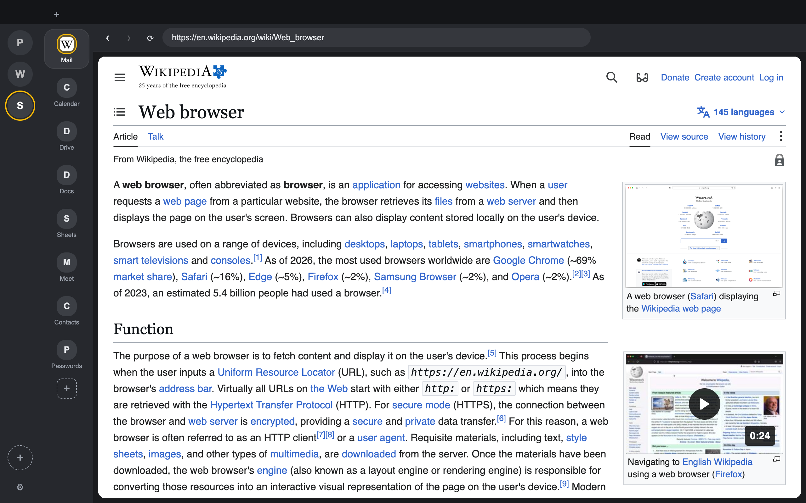
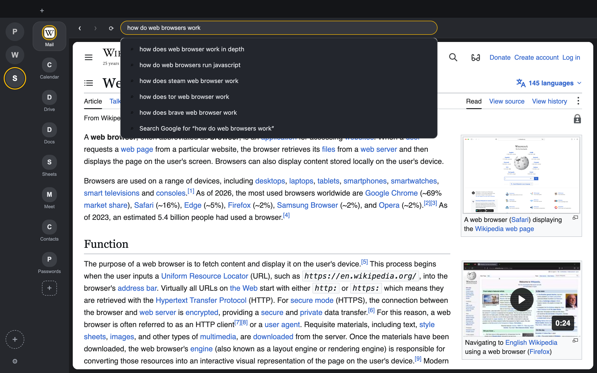
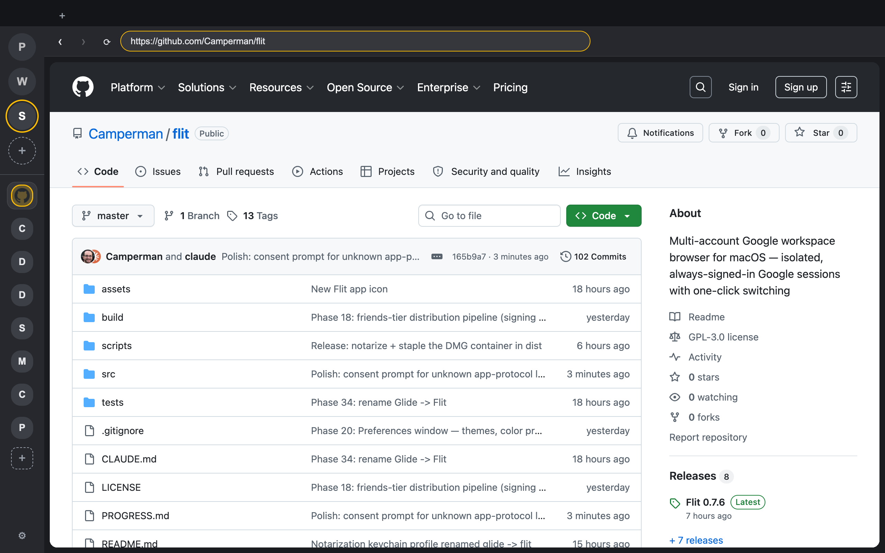

# Flit

**Flit is a web browser for macOS**, built around running multiple isolated
Google accounts side by side. Each account lives in its own permanently-signed-in
session — like Slack's workspace switcher, but every item in the sidebar is a
complete, fully isolated web session (Gmail, Calendar, Drive, Meet, and any
other site you browse).

Flit renders pages with Chromium (via Electron), so any site works exactly as
it does in Chrome.



**[Download for macOS (Apple Silicon)](https://github.com/Camperman/flit/releases/latest)** ·
[Website](https://camperman.github.io/flit/) ·
[Privacy](https://camperman.github.io/flit/privacy.html)

## Flit is a real browser

- **Address bar and search, front and center.** Every window opens with an
  omnibox: type a URL to navigate straight to it, or type anything else to
  search with your chosen engine (Google, DuckDuckGo, or Bing). As you type,
  the omnibox offers live search suggestions plus autocomplete from your
  history and bookmarks.
- **Navigates anywhere.** Enter any `http`/`https` URL and Flit loads that
  page directly, with full Chromium rendering — no wrappers, no proxies, no
  site restrictions.
- **Curated bookmarks.** A bookmarks bar (⇧⌘B) with folders, ⌘D to bookmark
  the current page, and one-click import of your Chrome bookmarks.
- **Default-browser support.** Flit registers for the `http` and `https`
  schemes: choose **File → Set as Default Browser…** and links clicked in any
  other app open as a tab in your active account.
- **Browser essentials throughout.** Tabs (with drag-reorder, ⇧⌘T reopen,
  audio indicators), history with a full history page (⌘Y), a downloads
  manager, find-in-page (⌘F), print (⌘P), spell-check, page zoom, incognito
  windows (⇧⌘N), and multiple windows (⌘N).



## What makes Flit different

Most browsers make you juggle profiles or log in and out. Flit gives every
account its own persistent, isolated session partition:

- **Isolated accounts** — one click to switch; every account stays signed in
  forever; accounts never bleed into each other or log each other out
  (isolation is verified by an automated test on every build).
- **Per-account app rail** — pin Gmail, Calendar, Drive, Docs, or any site as
  an app; each keeps its own always-loaded tab with a favicon and unread badge.
- **Unread badges & notifications** — native macOS notifications attributed to
  the right account, per-account mute, click a notification to jump there; the
  Dock badge shows total unread.
- **Command palette (⌘K)** — fuzzy-jump to any account, app, or open tab;
  ⌘1…9 and ⌥⌘↑/↓ switch accounts from the keyboard.
- **Chrome extensions** — installed per account from the Chrome Web Store
  (uBlock Origin Lite, etc.).
- **Six color themes** with light/dark/system appearance, plus per-account
  accent coloring.



## Feature list

Isolated multi-account sessions · omnibox with live search suggestions ·
choice of search engine (Google/DuckDuckGo/Bing) · history + omnibox
autocomplete + history page (⌘Y) · bookmarks bar + Chrome bookmark import ·
general browser tabs · downloads manager with persistent history ·
find-in-page · print · spell-check · page zoom · incognito windows ·
multiple windows · command palette (⌘K) · per-account pinned apps with
unread badges · native notifications with per-account mute · Chrome
extensions via the Chrome Web Store · Google Meet screen sharing · six
color themes, light/dark · default-browser registration · auto-update ·
signed, notarized, stapled DMG.

## Install (macOS, Apple Silicon)

Download the latest DMG from
[Releases](https://github.com/Camperman/flit/releases/latest), open it, and
drag Flit to Applications. Updates are delivered automatically from GitHub
Releases.

## Privacy

Everything stays on your Mac: sessions, history, bookmarks, and downloads are
stored locally, and Flit sends no telemetry or analytics. The only network
traffic is the sites you visit, search-suggestion queries to your chosen
engine, favicon/avatar fetches, and update checks against GitHub Releases.
Full policy: [Privacy](https://camperman.github.io/flit/privacy.html).

## Build from source

```sh
npm install
npm start            # dev with hot reload
npm run package      # local unsigned .app in dist/mac-arm64/
npm run dist         # signed + notarized DMG (requires signing setup below)
```

### Signing setup (maintainers)

`npm run dist` expects a **Developer ID Application** certificate in the
keychain and these environment variables for notarization:

```sh
# One-time: store notarization credentials in the keychain profile "flit".
xcrun notarytool store-credentials flit --apple-id "you@example.com" --team-id "XXXXXXXXXX"
```

`npm run dist` signs, notarizes, and staples both the app and the DMG
container (the DMG pass runs via `scripts/staple-dmg.mjs` after
electron-builder), so the result validates fully offline.

## Notes & limitations

- macOS only, Apple Silicon builds.
- Passkey sign-in over Bluetooth and Touch ID passkeys are not supported yet;
  use "Tap Yes on your phone", an authenticator code, or a password when
  signing in. Sessions persist, so this is one-time per account.
- Extensions needing native messaging (e.g. 1Password's biometric unlock) work
  only partially.
- Development history and architecture live in
  [REQUIREMENTS.md](REQUIREMENTS.md) and [PROGRESS.md](PROGRESS.md).

## Support

Questions and bug reports: [GitHub Issues](https://github.com/Camperman/flit/issues).

## License

[GPL-3.0](LICENSE). Extension support is provided by
[electron-chrome-extensions](https://github.com/samuelmaddock/electron-browser-shell)
(dual-licensed; used here under GPL-3.0).
